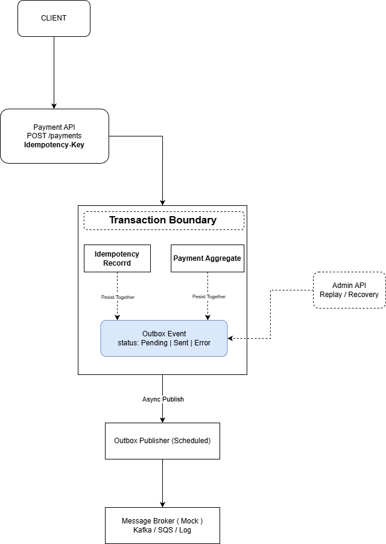

# Transactional Resilience

Transactional Resilience é um projeto focado em **confiabilidade transacional** para APIs críticas,
especialmente em cenários de **pagamentos, integrações assíncronas e sistemas distribuídos**.

O objetivo é demonstrar, de forma prática e evolutiva, como resolver problemas reais como:
- requisições duplicadas
- falhas parciais
- inconsistência entre banco e mensageria
- necessidade de recuperação e replay de eventos

Este projeto nasce como um **core técnico reutilizável**, podendo evoluir futuramente
para um **produto ou SaaS** focado em resiliência de sistemas.

---

## 🚨 O problema real

Em sistemas distribuídos, especialmente no domínio financeiro, é comum lidar com cenários como:

- timeout entre serviços
- retries automáticos do cliente
- duplicação de requisições
- falha ao publicar eventos após persistência em banco

Esses problemas podem gerar:
- pagamentos duplicados
- eventos perdidos
- inconsistência de estado
- retrabalho operacional

O Resilience Core aborda esses desafios de forma estruturada.

---

## 🧠 Proposta da solução

O projeto é baseado em alguns pilares fundamentais:

- **Idempotency Key** para garantir segurança contra duplicação de requisições
- **Transactional Outbox Pattern** para consistência entre banco de dados e eventos
- **Processamento assíncrono resiliente**
- **Mecanismo de Replay / Recovery** para eventos com falha
- Arquitetura clara e evolutiva, inspirada em **Clean Architecture / Hexagonal**

---

## 🏗️ Arquitetura

A arquitetura inicial do projeto está documentada abaixo:

O fluxo principal considera:
- uma API síncrona protegida por idempotência
- persistência transacional de dados e eventos
- publicação assíncrona
- capacidade de recuperação operacional

---

## 📁 Estrutura do projeto

resilience-core
├── docs
│ ├── architecture.png
│ ├── architecture.drawio
│ ├── decisions
│ └── roadmap.md
├── backend
├── infra
└── README.md

## 🗺️ Roadmap

O roadmap do projeto é incremental e pode ser consultado em:
- [docs/roadmap.md](docs/roadmap.md)

## 🚧 Status do projeto

🟡 Em construção  
Este repositório evolui gradualmente, com commits frequentes e foco em qualidade,
clareza arquitetural e problemas reais de produção.

## 📌 Observações

Este projeto não tem como objetivo ser um framework genérico,
mas sim um **exemplo realista e bem fundamentado** de como construir sistemas
resilientes em ambientes críticos.

